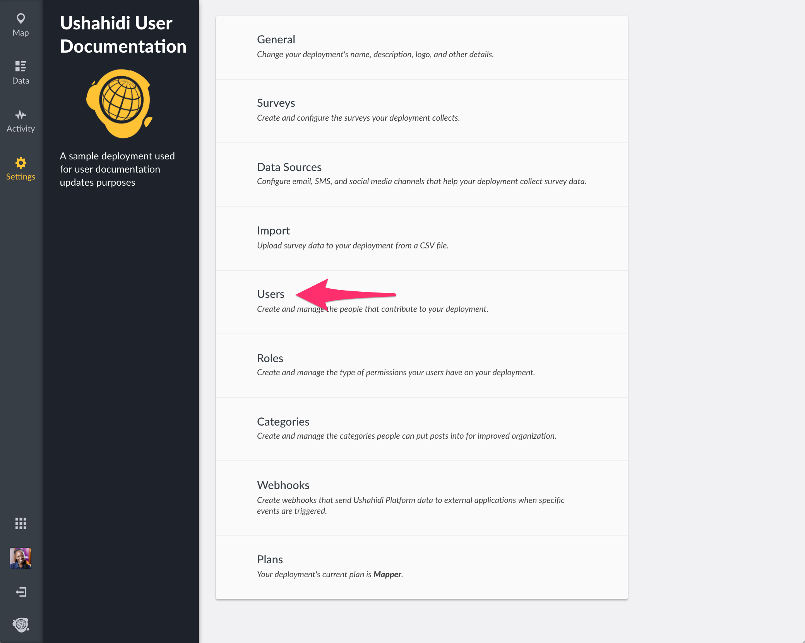
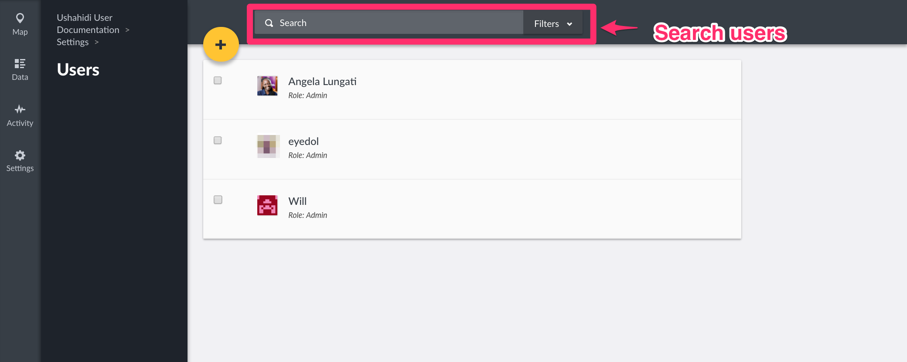
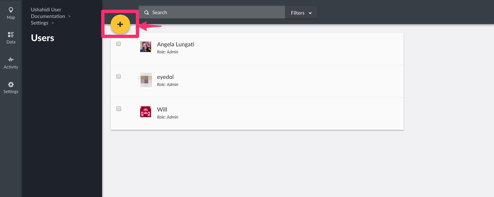
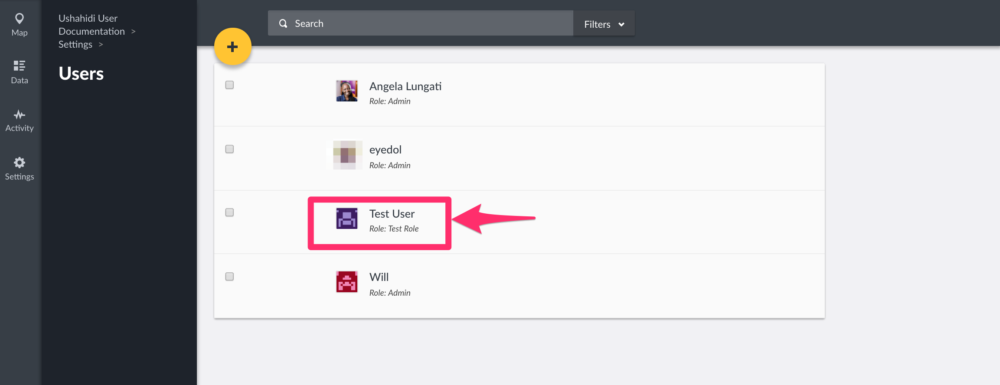
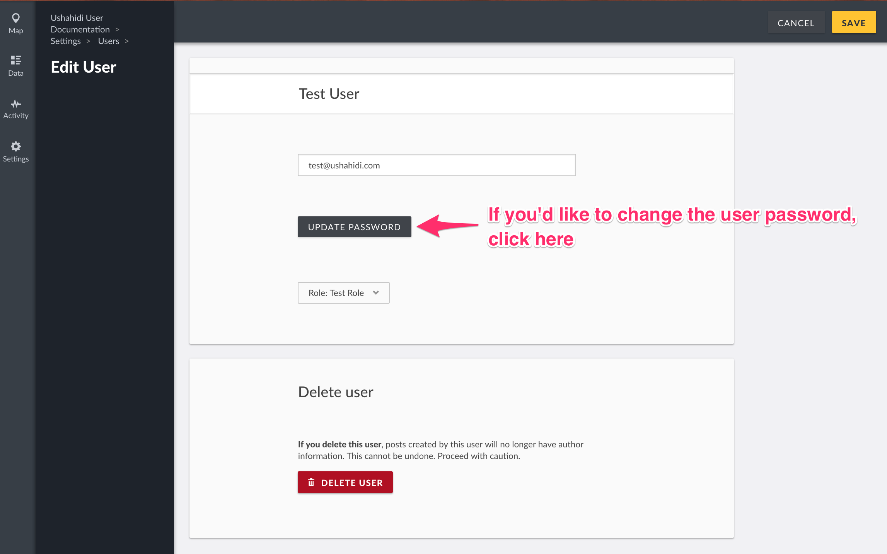
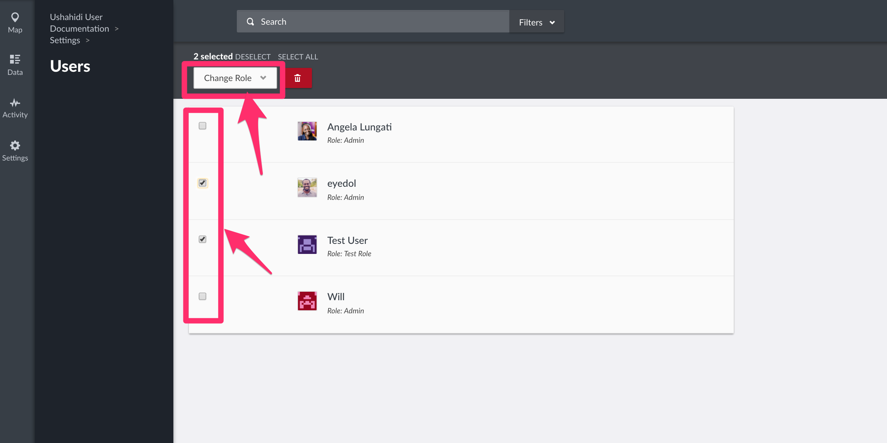
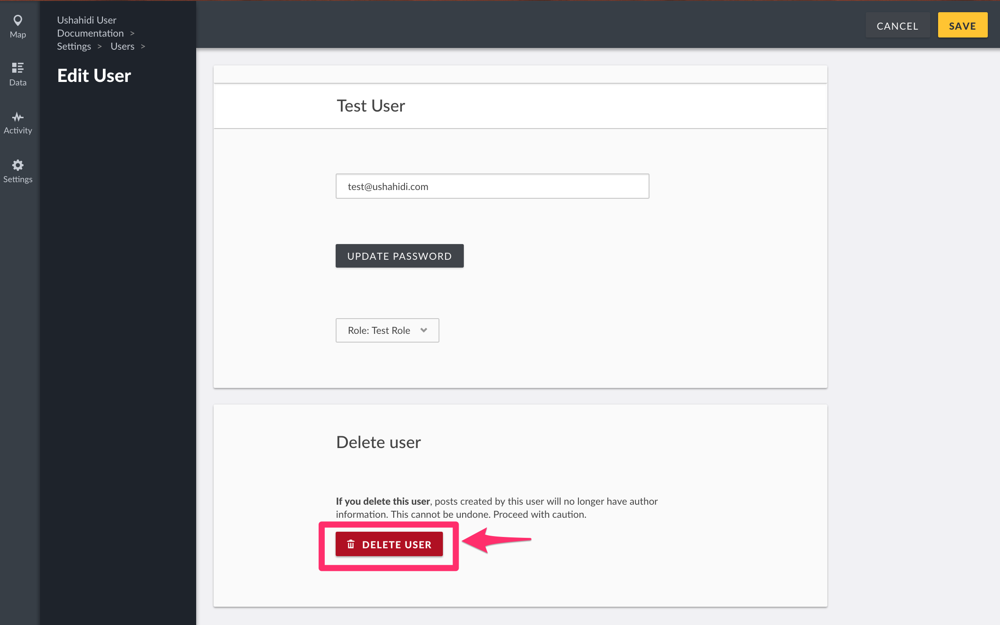
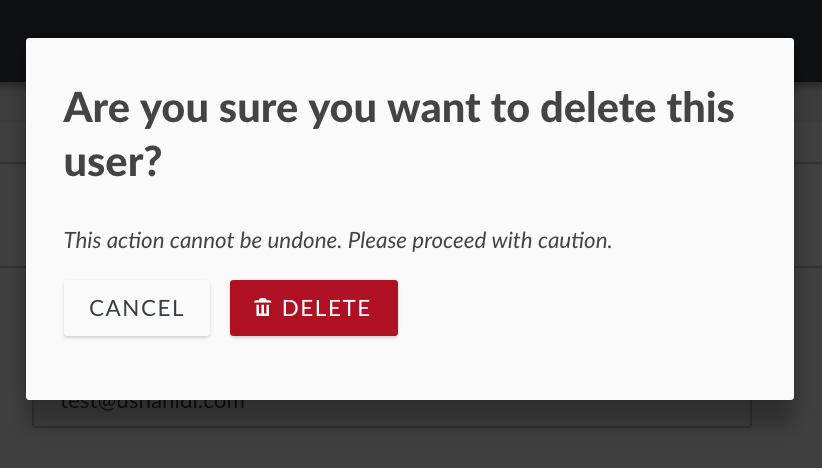
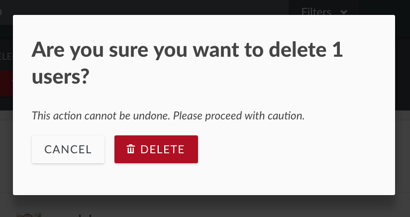

# 4.2 Users

To access the User management page,

* On the left hand menu bar, click on _**Settings**_

* Then, click on _**Users**_.

* You’ll be redirected to a page with a list of all existing users on your deployment
* If you are an ushahidi.io user, you should see the the user you created on set up listed on this page. If you are an ushahidi open source user, every installation comes with a default username: _**admin**_ and password: _**admin**_
* From here, you can search for users either by name or by custom role

* 
## 4.2.1 Adding new users 

To add a new user,

* Click on the _**yellow icon**_ ****as shown below

* Fill out the details below
* * _**Display Name**_: This is the name that will be displayed
  * _**Email address:**_ ****This is the email address that will be tied to this new user’s account, and will be used to log in.
  * _**Password:**_ ****Set a strong and secure password for your new user. Each password must have at least 7 characters
  * _**Role:**_ ****Choose the level of administration access you would like this user to have
* Click on _**Save**_ ****to create one.

## 4.2.2 Editing users 

To edit a user,

* Click on the user you intend to edit from the user list page

* You should be able to edit the user’s display name, email address, password and user role from this page.

* Click on _**save**_ when done.

## 4.2.3 Changing User roles 

You can change multiple users’ roles at once from the user management page.

* Tick the checkbox on the left, adjacent to the user\(s\) whose role you would like to change from the user list page
* This action will activate the previously inactive _**Change Role**_ ****dropdown button on the top menu bar.

                           

* Click on this dropdown and select the role you would like to assign your users to.

                           

* A pop up box will appear, prompting you to confirm whether you would like to change the roles of your user\(s\)

  * Click on _**OK**_ to change your user\(s\) role
  * If you’d like to cancel the role change process, click on _**Cancel.**_

  _\*\*\*\*_

                       _****_

## 4.2.4 Deleting users 

Similarly, you can delete multiple users at once from the user management page, or from the individual user edit page.

To delete a user

* From the individual user edit page

  * Click on the user you intend to edit from the user list page.

               

  * Click on _**Delete User.**_

  _\*\*\*\*_

                      _****_

* A pop up box will appear on the top of the page, prompting you to confirm whether you would like to delete your user

  * Click on _**Delete**_ to delete your user
  * If you’d like to cancel the user deletion process, click on _**Cancel.**_

  _\*\*\*\*_

                _****_

* From the User management page
  * Tick the checkbox on the left, adjacent to the user\(s\) you would like to delete from the user list page
* * This action will activate the previously inactive _**Delete**_ button on the top menu bar. Click on it to initiate the deletion process.

                

  * A pop up box will appear, prompting you to confirm whether you would like to delete your user\(s\)

    * Click on _**DELETE**_ to delete your user\(s\)
    * If you’d like to cancel the user deletion process, click on _**Cancel.**_

    _\*\*\*\*_

          _****_

