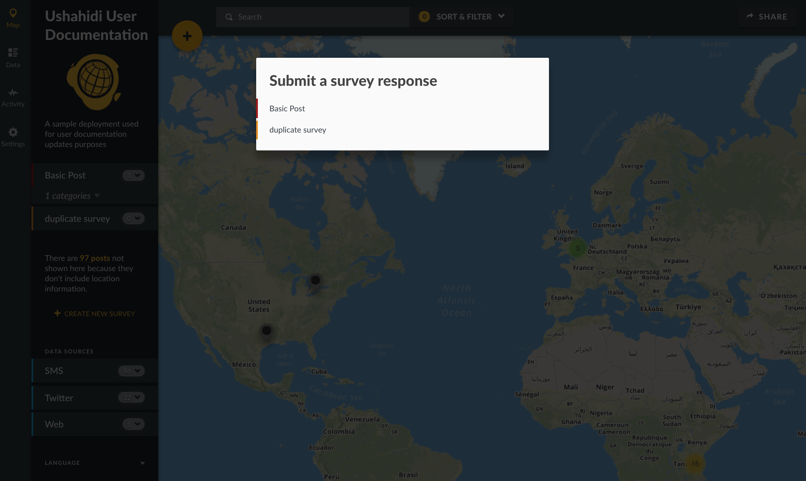

# 6.3 Adding Posts

## 6.3.1 Directly from the Web

Registered/non registered users can create posts using the same process described below. For descriptive purposes, the post below has one tasks.

To create a post,

* Click on the yellow add icon as shown below on your homepage, or on the bottom left corner on the data mode page

                                            

* In the event that you have multiple surveys on your deployment, you’ll have to choose the survey from a list of all surveys available on your deployment.

                                           

* At the upper left corner of the page, click on the dropdown menu and see the available languages that the survey form can be viewed in, click on the language you prefer and fill the form in the chosen language.
* Make sure to fill out all fields with a red asterisk beside them, You will not be able to save or publish your post before these fields are filled out.
  * NB: [Users are now able to submit improvements to the OpenStreetMap Basemap, directly from the post submission page](https://www.ushahidi.com/blog/2017/04/06/using-mapbox-at-ushahidi). In some cases, base maps are not up to date. We highly encourage you to contribute to improving base maps in your locations of interest. For more details on how to improve OpenStreetMap, [visit the OSM wiki here.](https://wiki.openstreetmap.org/wiki/Beginners'_guide) 
* Make sure to fill out any tasks visible to you on this submission page as well. NB: You can submit posts without filling out or completing tasks. However, in the event that your task is a requirement for publishing, this post will not be published unless the task is marked as complete.
* When you’re done adding content for your post, click on _**Submit.**_                         

* Your post will be submitted to the deployment’s admin for review before publishing.

## 6.3.2 Email

If email has been configured and enabled as a data source on your deployment, users will be able to send in posts directly by sending an email to the email address configured. These will appear in your data mode view, and available via the search filter. [See chapter 3.4 for more configuration details](../3.-configuring-your-deployment/3.4-data-sources.md)

## 6.3.3 Twitter

If Twitter has been configured and enabled as a data source on your deployment, you will be able to pull in tweets corresponding to the hashtags you have indicated. These will appear in your data mode view, and available via the search filter. [See chapter 3.4 for more configuration details](../3.-configuring-your-deployment/3.4-data-sources.md)

## 6.3.4 SMS

If SMS has been configured and enabled as a data source on your deployment, users will be able to send in text messages directly to a configured short code or sms number of your choice, which will be pulled in to your data view and available via the search filter. [See chapter 3.4 for more configuration details](../3.-configuring-your-deployment/3.4-data-sources.md)

## 6.3.5 Smartphone apps

Users should be able to download the Ushahidi Mobile app for [Android](https://play.google.com/store/apps/details?id=com.ushahidi.mobile&hl=en) or [iOS](https://itunes.apple.com/us/app/ushahidi-mobile/id1205994516?ls=1&mt=8), search for your deployment, or add the URL directly. Once synced, they should be able to add posts directly onto your deployment in a similar manner to the web app.

